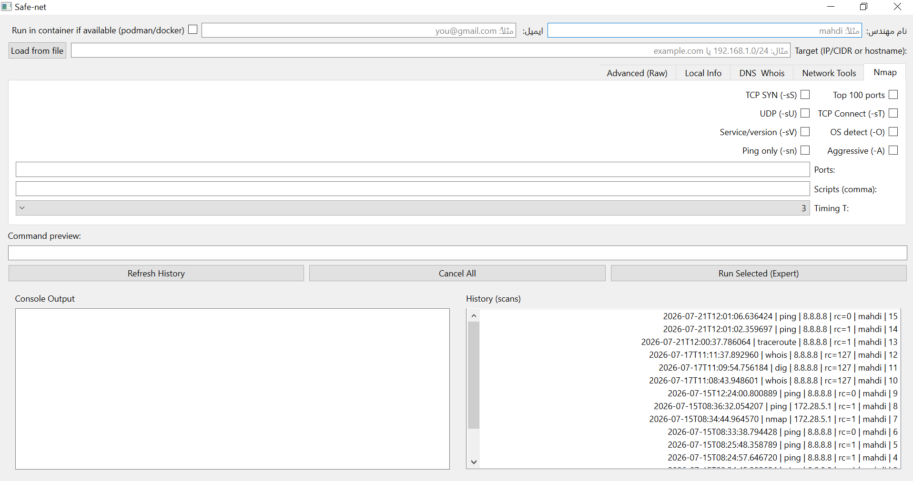

# NSec Toolkit

NSec Toolkit is a desktop application developed with Python and PySide6 that provides a graphical interface for common network reconnaissance and diagnostic tools.

The main goal of this project is to make frequently used networking commands easier to use through a simple GUI while keeping the flexibility of the original command-line tools.

The application combines several popular networking utilities such as Nmap, Ping, Traceroute, Dig, Whois, Netstat, and others into a single interface. Scan results are stored locally in an SQLite database, allowing users to review previous scans whenever needed.

This project was developed as a personal project to improve my Python programming skills, networking knowledge, and desktop application development experience.

---

## Features

- User-friendly graphical interface built with PySide6
- Nmap scanning with multiple scan options
- Ping
- Traceroute
- Whois lookup
- DNS lookup (Dig)
- Netstat
- ARP table viewer
- Local IP information
- Scan history using SQLite
- Docker / Podman support
- Export scan results
- Dark user interface

---

## Screenshots


---

## Requirements

- Python 3.11 or newer
- PySide6

Required networking tools:

- Nmap
- Ping
- Traceroute
- Whois
- Dig

Some tools are not installed by default on Windows and must be installed manually.

---

## Installation

Clone the repository:

```bash
git clone https://github.com/Mahdi-work/safe.net.git
```

Go to the project directory:

```bash
cd nsec-toolkit
```

Create a virtual environment:

```bash
python -m venv .venv
```

Activate it:

### Windows

```bash
.venv\Scripts\activate
```

### Linux

```bash
source .venv/bin/activate
```

Install dependencies:

```bash
pip install -r requirements.txt
```

Run the application:

```bash
python main.py
```

---

## Project Structure

```
NSec-Toolkit/
│
├── main.py
├── requirements.txt
├── README.md
├── LICENSE
├── .gitignore
├── nsec_toolkit.db
└── assets/
```

---

## Technologies Used

- Python
- PySide6
- SQLite
- subprocess
- threading
- Nmap
- Docker / Podman

---

## Database

The application uses SQLite to store scan history and related information.

Stored information includes:

- Executed commands
- Scan targets
- Scan results
- User information
- Command history

---

## Future Development

This project is still under active development, and I plan to continue improving it over time by adding new features and enhancing the existing ones.

Some planned improvements include:

- Better visualization of scan results
- Improved Nmap XML parsing
- PDF, HTML, and CSV report generation
- Multiple concurrent scans
- Better scan management
- Search and filtering for scan history
- Performance and stability improvements
- UI/UX enhancements
- Support for additional networking tools
- More customization options

In addition to the items listed above, more features and improvements will be added as the project continues to evolve.

Suggestions and feedback are always welcome.

---

## Known Limitations

- Some features require external networking tools to be installed.
- A few commands may require administrator/root privileges.
- Tool availability depends on the operating system.

---

## Contributing

If you have suggestions or ideas that could improve the project, feel free to open an issue or submit a pull request.

---

## License

This project is licensed under the MIT License.

---

## Author

**Mahdi Gilak**

Computer Engineering Student (Information Technology)

GitHub: https://github.com/Mahdi-work
```